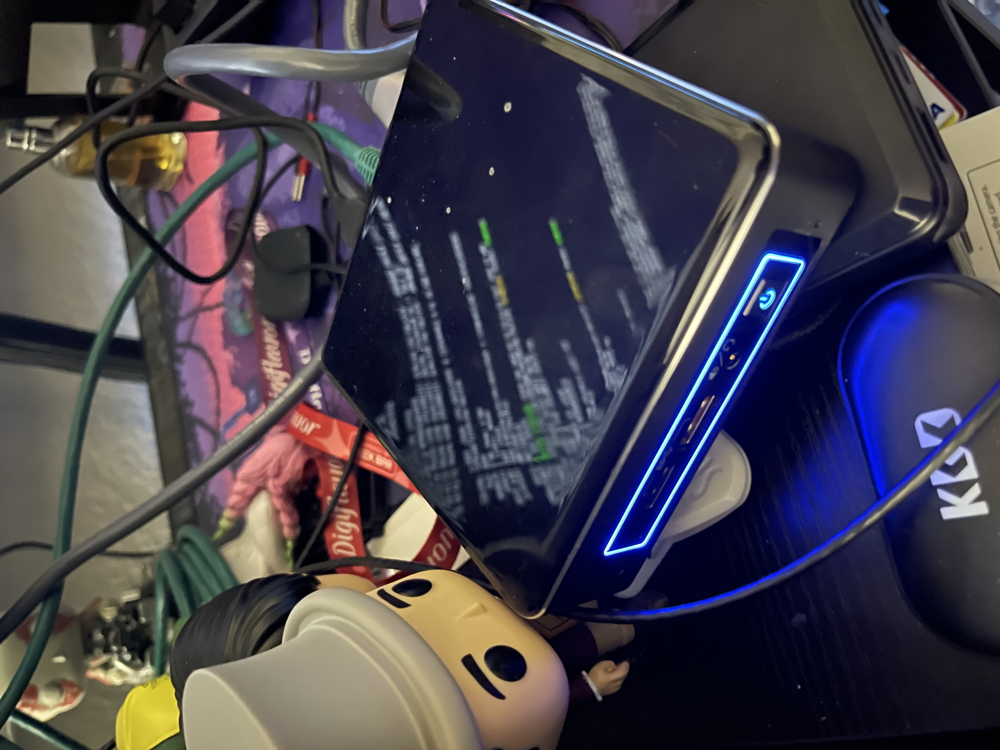
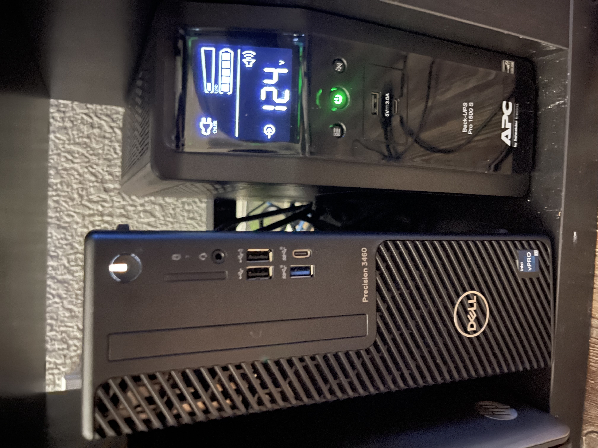
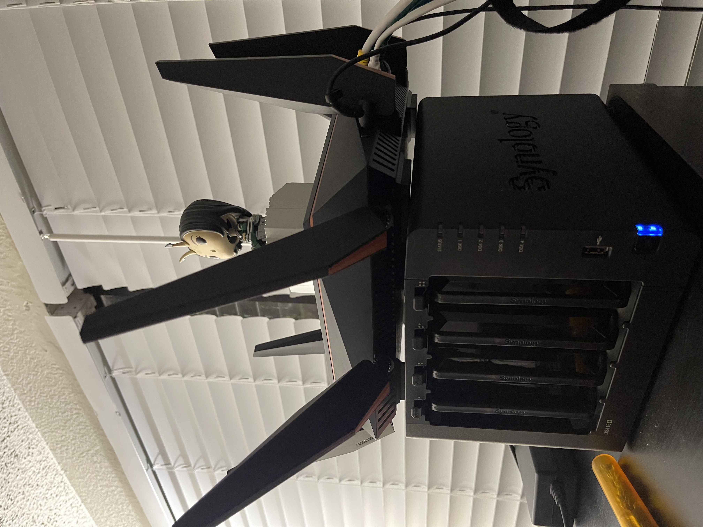

# Kubernetes Home Lab

This repository documents my journey in creating a new Kubernetes home lab from scratch. Unlike my previous project, where I set up a server running Proxmox, Docker, and other services without thorough documentation, this project will focus on clear and detailed documentation of each step, from setup to deployment.

## 🔧 Hardware and Existing Setup
- **Existing Server**: Running Proxmox, Docker, and other services for general virtualization and containerized workloads.
- **New Project**: This Kubernetes home lab is a fresh initiative built alongside my existing setup.
- **Additional Hardware**:
  - **Router**: ROG Rapture GT-AC5300
  - **Server**: Precision 3460 (i7 12th Gen)
  - **Additional Node**: Intel NUC (i7)
  - **Storage**: Synology DS415+
  - **Internet**: Fiber (ISP modem)
  - **UPS**: Uninterruptible Power Supply for power management

### Hardware Setup Images

#### Intel NUC

#### PC and UPS

#### Router and NAS

## 🛠️ Features and Goals
- **New Documentation Approach**: This project will include detailed documentation of every step, improving on my earlier Proxmox and Docker setup, which lacked sufficient documentation.
- **Multi-Node Kubernetes Cluster**:
  - Control plane on a dedicated server
  - Worker node on Intel NUC
- **Persistent Storage**: Leveraging Synology NAS with NFS.
- **Application Deployment**: Containerized apps using Kubernetes manifests.
- **CI/CD Pipelines**: Automated deployments using GitHub Actions.
- **Cluster Monitoring**: Integration of Prometheus and Grafana for real-time metrics.

## 📁 Repository Structure
- `docs/`: Documentation for setup and deployment
- `manifests/`: Kubernetes manifests for applications
- `scripts/`: Automation scripts for setup and maintenance
- `Pics/`: Visuals of the hardware setup and screenshots

## 🚀 Getting Started

Follow the step-by-step instructions in the [docs](docs/) folder to set up your own Kubernetes home lab.

---

Stay tuned for more updates as I document my journey!
